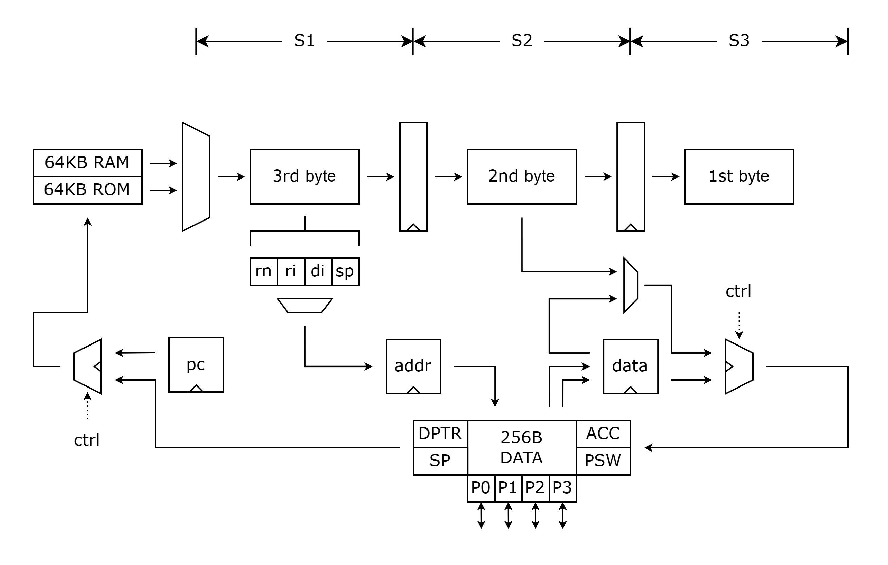

# T8051

This is a repository for a soft CPU core compatible for Intel 8051. 8051 based microcontrollers typically include one or two UARTs, two or three timers, 128 bytes of internal data memory, 512 bytes to 64 KB of internal program memory, up to 128 bytes of I/O. 8051 variants may include extra internal storage, more parallel ports and data bus etc.

## Introduction

Since our CPU will be implemented on FPGA, different execution/memory architectures and more peripheral ports can be configured.

- We build a three-stage pipelined architecture for instruction execution, where each instruction must takes three machine cycles to finish execution.
- We set up 64 KB external ROM and 64 KB external RAM according to the maximum addressable space.
- We hope to provide a controller for the peripherals on FPGA board soon.

## Architecture

## Implementation

We run FPGA implementation in Vivado, the core utilization is shown below.

| Resource    | LUT   | FF    | IO    | BUFG  |
| ----------- | ----- | ----- | ----- | ----- |
| Utilization | 24174 | 2244  | 109   | 1     |

## Reference

[Intel 8051 - Wikipedia](https://en.wikipedia.org/wiki/Intel_8051)
